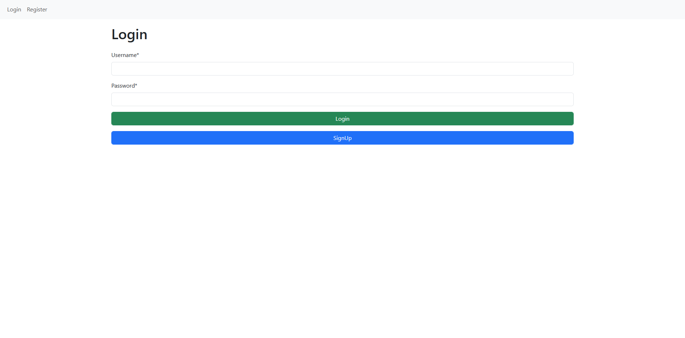
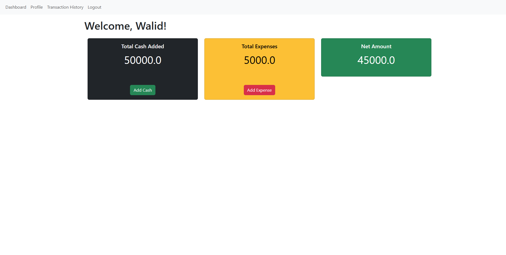

# Personal Cash Management System

A basic personal cash management web application built with **Django** and **Bootstrap**. The application allows registered users to record their income and expenses, review their transactions, and manage their personal profile through a simple and responsive interface.

This project was developed as part of the **Web Application Development with Python – Level 4** assignment.

## Features

- User registration
- User login and logout
- Custom user authentication using Django's `AbstractUser`
- Registration form based on `UserCreationForm`
- Login form based on `AuthenticationForm`
- User profile management
- Personal cash management dashboard
- Add income or cash entries
- Add expense entries
- View income and expense transactions
- User-specific financial records
- Django Forms for form handling and validation
- Responsive Bootstrap interface
- Django admin panel for managing application data

## Technologies Used

- Python
- Django
- HTML5
- CSS3
- Bootstrap
- SQLite
- Django Forms
- Django Authentication System

## Main Data Models

### AddCash

Stores the income or cash added by a user.

| Field | Description |
|---|---|
| `user` | The user who owns the record |
| `source` | Source of the income |
| `datetime` | Date and time of the transaction |
| `amount` | Amount of cash received |
| `description` | Additional information about the transaction |

### Expense

Stores a user's expense records.

| Field | Description |
|---|---|
| `user` | The user who owns the record |
| `description` | Details of the expense |
| `amount` | Amount spent |
| `datetime` | Date and time of the transaction |

Each income and expense record is connected to one user, while a user can have multiple transaction records.

## Authentication

The project uses Django's built-in authentication system with a custom user model created from `AbstractUser`.

- `UserCreationForm` is used as the base for registration.
- `AuthenticationForm` is used for user login.
- Django sessions are used to keep users authenticated.
- Financial records are associated with the currently logged-in user.
- Protected pages should only be accessible to authenticated users.

## Project Requirements

The application includes the following required components:

- A Django project for the personal cash management system
- A Django application named `ManageCash`
- Income and expense models
- Login and registration pages
- Profile management
- Cash management dashboard
- Forms for adding cash and expenses
- URL configuration
- View functions and application logic
- Database migrations
- Django superuser
- Model registration in the Django admin panel

## Installation and Setup

### 1. Clone the repository

```bash
git clone https://github.com/WalidShahriar/cash-management-system-with-django.git
cd cash-management-system-with-django
```

### 2. Create a virtual environment

```bash
python -m venv venv
```

Activate the virtual environment.

**Windows:**

```bash
venv\Scripts\activate
```

**macOS/Linux:**

```bash
source venv/bin/activate
```

### 3. Install the required packages

```bash
pip install django
```

If the repository contains a `requirements.txt` file, use:

```bash
pip install -r requirements.txt
```

### 4. Apply database migrations

```bash
python manage.py makemigrations
python manage.py migrate
```

### 5. Create an administrator account

```bash
python manage.py createsuperuser
```

Use a secure password instead of publishing administrator credentials in the repository.

### 6. Run the development server

```bash
python manage.py runserver
```

Open the following address in your browser:

```text
http://127.0.0.1:8000/
```

The Django admin panel is usually available at:

```text
http://127.0.0.1:8000/admin/
```

## Basic Usage

1. Create a new user account.
2. Log in with the registered username or email and password.
3. Open the cash management dashboard.
4. Add income using the Add Cash form.
5. Add spending using the Expense form.
6. Review the recorded financial transactions.
7. Update profile information when needed.
8. Log out after completing the session.

## Suggested Project Structure

```text
project-root/
├── manage.py
├── requirements.txt
├── README.md
├── Name_ID_ManageCash/
│   ├── settings.py
│   ├── urls.py
│   ├── asgi.py
│   └── wsgi.py
└── ManageCash/
    ├── migrations/
    ├── templates/
    ├── static/
    ├── admin.py
    ├── apps.py
    ├── forms.py
    ├── models.py
    ├── urls.py
    └── views.py
```

Update the structure above if your actual project or folder names are different.

## Security Notes

- Do not upload secret keys, passwords, or personal credentials to GitHub.
- Keep sensitive settings in environment variables for production use.
- Set `DEBUG = False` before deploying the application publicly.
- Configure `ALLOWED_HOSTS` correctly in production.
- Use a strong password for the Django administrator account.
- Make sure users can only access their own cash and expense records.

## Possible Future Improvements

- Transaction editing and deletion
- Monthly and yearly financial summaries
- Category-based expense tracking
- Search and transaction filtering
- Charts for income and spending
- Budget limits and savings goals
- Downloadable reports
- Email-based password reset
- Pagination for transaction history
- Deployment to a cloud hosting platform

## Screenshots

<!-- Add screenshots of the project to a folder such as `screenshots/`, then include them here. -->

```markdown


```

## Author

**MD WALID SHAHRIAR**

- GitHub: [@WalidShahriar](https://github.com/WalidShahriar)

## License

This project is intended for educational purposes. You may add an open-source license, such as the MIT License, if you plan to share or reuse the project publicly.
